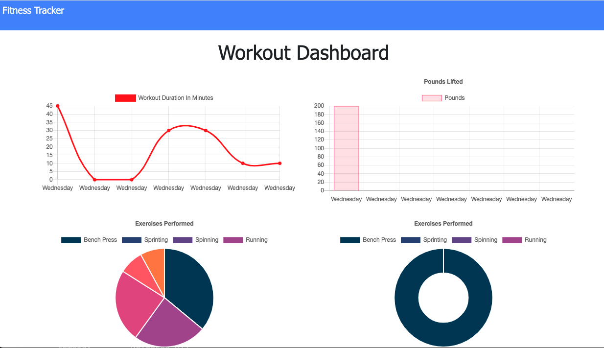
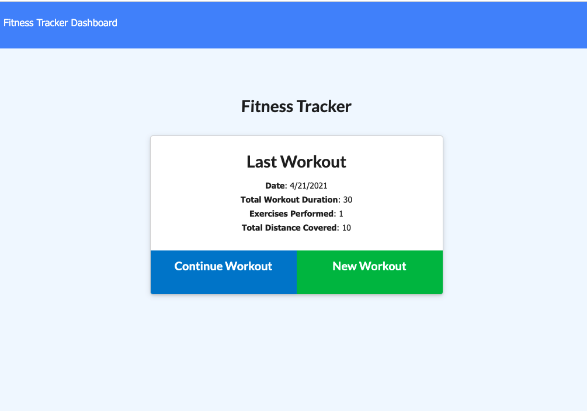
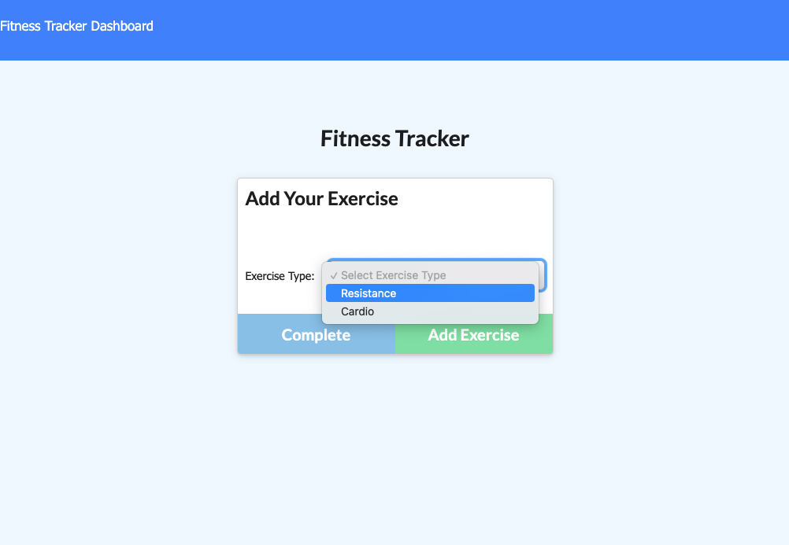
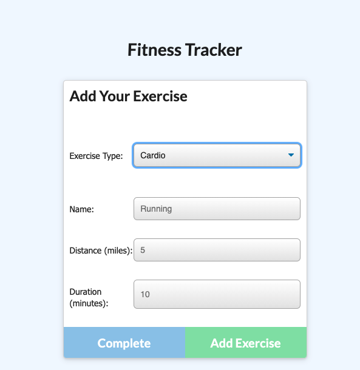
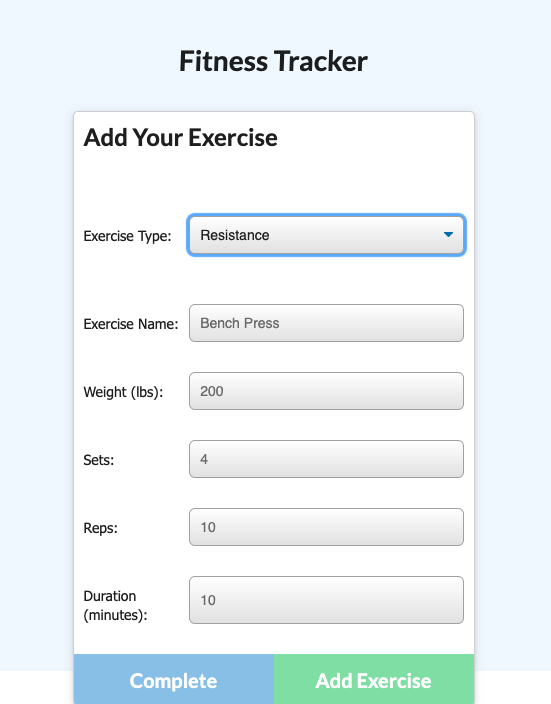

# Workout Tracker

This app is a workout tracker using a Mondo Database, Mongoose Schema, Express. The app allows user to create and track their daily workouts. 

The user can:

  * Add exercises to the most recent workout plan.

  * Add new exercises to a new workout plan.

  * View the combined weight of multiple exercises from the past seven workouts on the `stats` page.

  * View the total duration of each workout from the past seven workouts on the `stats` page.

## Istallation

The app uses the following:
  * Node.js
  * Express.js
  * MongoDB
  * Mongoose

The app can be run locally by running ```npm i``` and ```npm start```
There is a seed file provided which can be run using ```npm run seed``` 

The app is deployed to Heroku [here](https://pacific-badlands-32888.herokuapp.com/)

## Dashboard


## Homepage


## Add Workout


